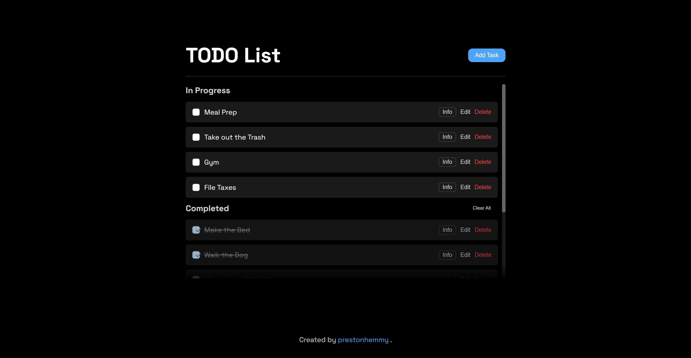
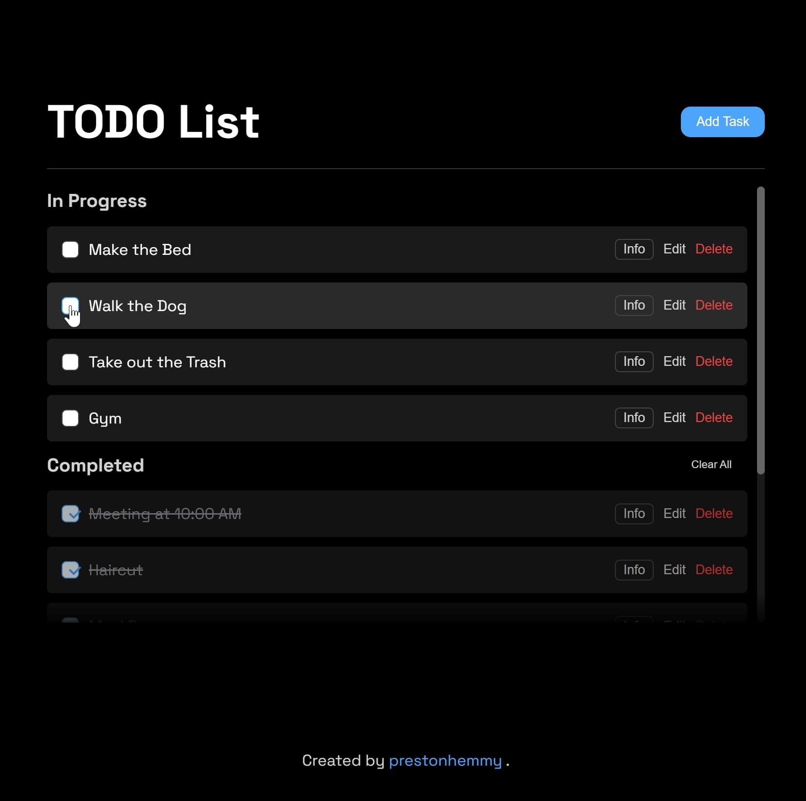
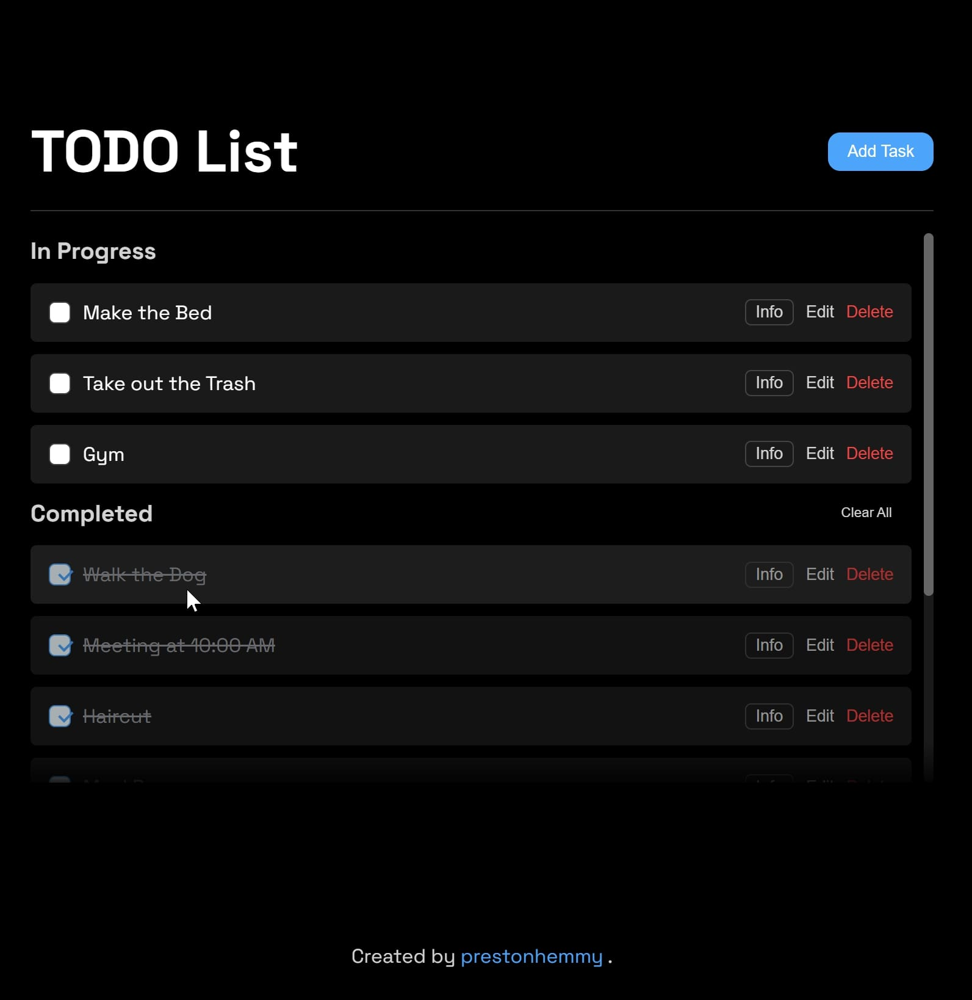
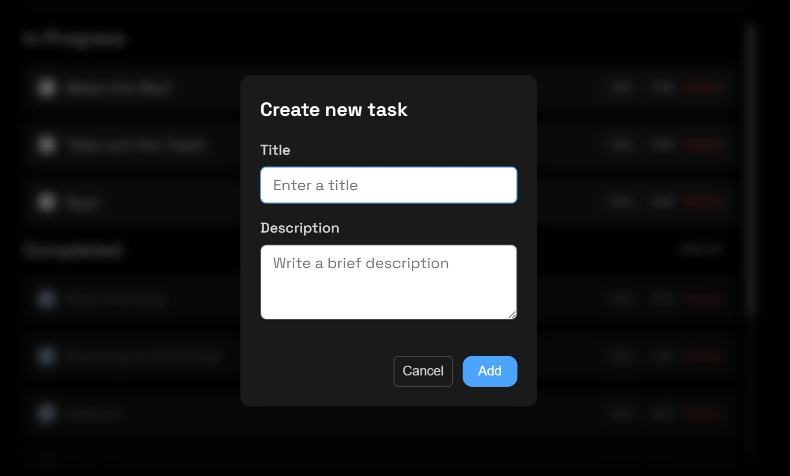
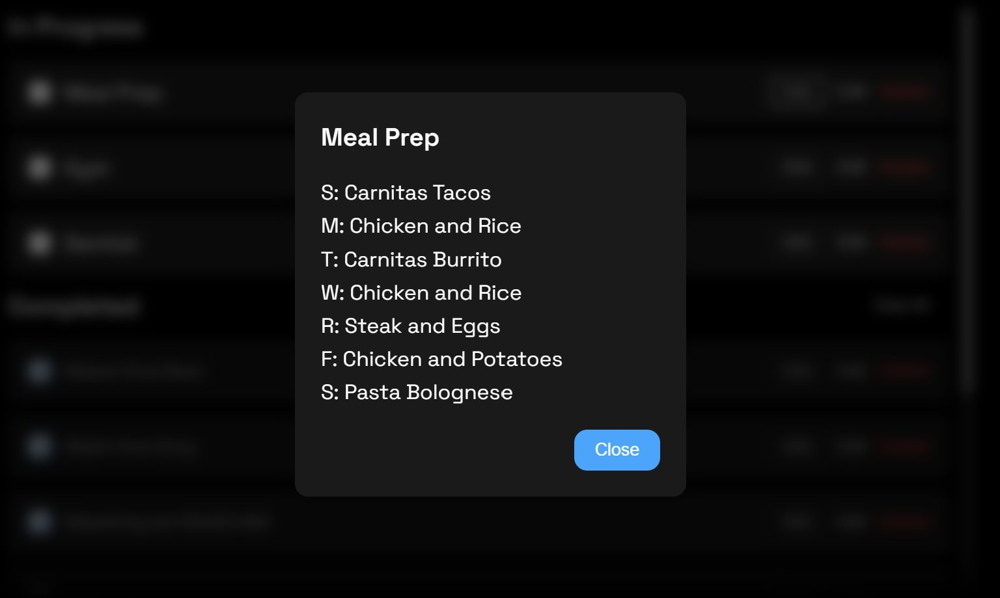
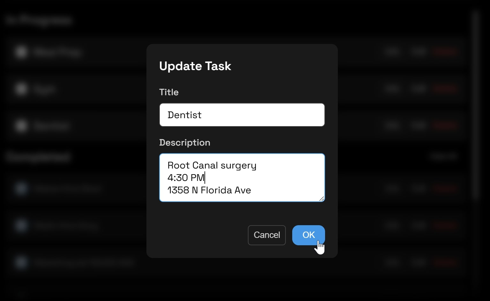
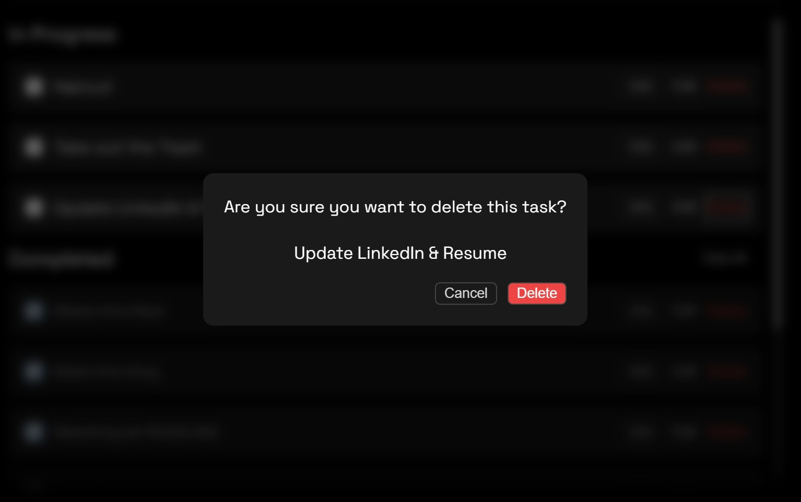

# React Todo App

A clean and modern todo list application built with React and CSS.

## Features
- ✅ Add, edit, and delete tasks
- 📝 Show task descriptions
- 🎨 Light/Dark mode support (defaulting to system)
- 💾 Local storage persistence
- 🎯 Smooth animations
- 📱 Responsive design

## Technologies
- React 19.1
- CSS Modules
- CSS Variables for theming

## Installation
```
bash
git clone https://github.com/yourusername/react-todo-app.git
cd react-todo-app
npm install
npm start
```

## Screenshots

The application sports a modern look and feel with responsive sections for 'In Progress' and 'Completed' visible only if tasks are present, minimal styled pop-up windows and smooth animations.



Easy to use checkboxes automatically transfer your task from 'In Progress' to 'Completed', applying a strikethrough and grayed-out effect.





Minimal styled pop-up windows for creating a new task, seeing a given task's description, editing a task and deleting a task offer a focused view for seeing information and making changes corresponding to a single task.

